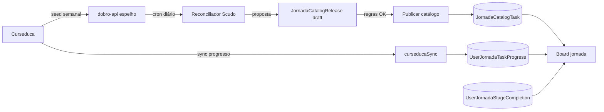

# Opções Seguras para Sincronização Curseduca x Jornada Scudo

## Contexto do risco

Hoje, o progresso da jornada é persistido por par `(userId, taskId)` em `UserJornadaTaskProgress`. Isso torna o sistema robusto para marcação de conclusão, mas cria risco alto quando o catálogo muda:

- se um `taskId` for removido ou renomeado, o histórico pode ficar órfão;
- se tarefas novas forem inseridas no meio de um rank, o `editableStageId` pode mudar e afetar a visualização/progressão;
- se a lista da Curseduca divergir da Scudo, o aluno pode ver tarefas fora de sincronia.

Arquivos atuais relevantes:

- `app/lib/jornada/mockJornada.ts`: catálogo estático de stages/tasks.
- `app/lib/jornada/service.ts`: cálculo do rank editável e snapshot.
- `app/lib/jornada/curseducaLessonTaskMap.ts`: mapa explícito `lessonId -> taskId`.
- `app/lib/jornada/curseducaSync.ts`: sync de progresso concluído (não sincroniza catálogo).

## Princípios de segurança (obrigatórios em qualquer opção)

1. Nunca reaproveitar nem renomear `taskId` existente.
2. Nunca remover fisicamente tarefa já publicada; usar `deprecatedAt`/`isActive=false`.
3. Mudanças de catálogo devem ser aditivas (append-only) por versão.
4. Rank já concluído deve continuar concluído, mesmo após entrada de novas aulas.
5. Sincronização de progresso deve ser idempotente (upsert) e com auditoria.
6. Publicação de mudanças deve usar janela controlada + rollback rápido.

## Opção 1 (mais segura e simples): Catálogo versionado + publicação manual assistida

### Como funciona

- Mantém a Curseduca como fonte de verdade apenas para progresso (`finishedAt`), como já existe.
- Catálogo da Scudo continua próprio, mas com governança:
    - criar uma versão de catálogo (`catalogVersion`) sempre que entrar aula nova;
    - adicionar novas tarefas sem alterar IDs antigos;
    - validar automaticamente antes de publicar (lint de catálogo).
- Publicação pode ser assistida por IA para gerar proposta de tarefas, mas aprovação final é humana.

### Regras para não quebrar progresso

- `taskId` imutável para tarefas já publicadas.
- Inserção apenas no fim do rank (ou com `order` novo sem reordenar tarefas já existentes).
- Se precisar “substituir” aula, desativa a antiga e cria nova tarefa com novo `taskId`.
- Para alunos com rank concluído: manter “concluído por snapshot” (ver seção Modelo de dados recomendado).

### Prós

- Menor custo e menor risco operacional imediato.
- Aproveita o que já existe no projeto.
- Fácil rollback (reverter versão de catálogo).

### Contras

- Processo depende de operação manual.
- Tempo de atualização pode ser maior.

## Opção 2 (equilíbrio): Banco interno de catálogo Curseduca + sync semanal por cron + publicação controlada

### Como funciona

- Criar tabela interna com espelho de aulas da Curseduca (`externalLessons`).
- Cron semanal busca API da Curseduca e atualiza esse espelho.
- Um reconciliador compara espelho x catálogo Scudo e gera diff:
    - `novas aulas`, `aulas alteradas`, `aulas removidas`.
- Diferenças viram proposta de release de catálogo (não aplica automático em produção sem aprovação).

### Regras para não quebrar progresso

- Remoção externa não remove tarefa interna publicada; apenas marca como obsoleta.
- Alteração de título/ordem não muda `taskId`.
- Novas aulas entram como novas tarefas com novos IDs.
- Publicação com feature flag por coorte ou por data.

### Prós

- Reduz dependência de atualização manual.
- Gera rastreabilidade do que mudou na Curseduca.
- Mantém governança forte para preservar progresso.

### Contras

- Exige nova camada de dados + cron + reconciliador.
- Complexidade maior que a Opção 1.

## Opção 3 (mais automatizada, maior complexidade): ingestão contínua + regras de compatibilidade + auto-release com canário

### Como funciona

- Ingestão frequente (cron diário ou webhook, se a Curseduca oferecer).
- Reconciliador aplica regras de compatibilidade e já gera release de catálogo automaticamente.
- Auto-release em canário (pequena porcentagem), depois rollout total.

### Regras de proteção obrigatórias

- Bloquear release automático se detectar:
    - tentativa de alteração de `taskId` publicado;
    - redução de tarefas em rank já ativo;
    - mudança que rebaixe `editableStageId` de usuários já avançados.

### Prós

- Catálogo sempre mais atualizado.
- Menor esforço manual no longo prazo.

### Contras

- Maior risco de incidente se regras estiverem incompletas.
- Exige maturidade de observabilidade e operação.

## Modelo de dados recomendado (base para todas as opções)

Para proteger usuários já avançados, separar “catálogo” de “estado do usuário”:

1. `JornadaCatalogTask`
    - `id` (interno), `taskId` (imutável), `stageId`, `kind`, `title`, `order`, `isActive`, `catalogVersion`, `externalLessonId`.
2. `JornadaCatalogRelease`
    - versão, status, data de publicação, autor, changelog.
3. `UserJornadaStageCompletion`
    - `userId`, `stageId`, `completedAt`, `catalogVersionAtCompletion`.

Com isso:

- o usuário que já concluiu um rank não perde conclusão ao entrar aula nova depois;
- o cálculo de rank atual pode respeitar `completedAt` da etapa, em vez de depender só da lista atual de tarefas.

## Regra de negócio recomendada para ranks já concluídos

Quando entrar nova tarefa em uma etapa já concluída por um usuário:

1. manter a etapa como concluída (`UserJornadaStageCompletion` prevalece);
2. manter novas tarefas dessa etapa como pendentes (opcionalmente em seção “conteúdo novo”);
3. não retroceder `editableStageId` do usuário;
4. permitir conclusão manual dessas novas tarefas sem bloquear avanço já obtido.

Essa abordagem preserva progressão e evita regressão de UX.

## Estratégia recomendada para a Scudo (ordem de adoção)

1. Implementar Opção 1 imediatamente (rápido e seguro).
2. Evoluir para Opção 2 com cron semanal e reconciliador com aprovação humana.
3. Só considerar Opção 3 após ter métricas, alertas e rollback maduros.

## Priorização por simplicidade e velocidade

Se a prioridade for entregar rápido com baixo risco de regressão, a ordem prática é:

1. Opção 1 (catálogo versionado + publicação manual assistida).
2. Opção 2 (espelho interno + cron semanal + aprovação humana).
3. Opção 3 (automação contínua com canário).

### O que é mais simples e rápido na prática

#### Caminho A (hotfix imediato, menor esforço)

- Manter catálogo atual em código.
- Adotar regra operacional: apenas adicionar tarefas novas, nunca remover/renomear `taskId`.
- Atualizar `CURSEDUCA_LESSON_TASK_MAP` quando houver aula nova.
- Publicar checklist de validação antes de deploy (incluindo teste de não regressão de rank).

Esforço relativo: baixo.
Tempo relativo: curto.
Risco: baixo, desde que a disciplina de operação seja seguida.

#### Caminho B (rápido e mais robusto)

- Tudo do Caminho A.
- Adicionar `UserJornadaStageCompletion` para congelar etapas já concluídas por usuário.
- Ajustar cálculo de rank para não retroceder quem já concluiu etapa.

Esforço relativo: médio.
Tempo relativo: curto para médio.
Risco: baixo a médio (ganho importante de proteção de progresso).

#### Caminho C (automação com cron)

- Tudo do Caminho B.
- Criar espelho interno de aulas + job semanal + reconciliador com aprovação humana.

Esforço relativo: médio a alto.
Tempo relativo: médio.
Risco: médio (mais moving parts), porém com melhor governança.

### Recomendação objetiva

Para simplicidade, adotar agora o Caminho A e já planejar o Caminho B na sequência.

- Semana atual: Caminho A (proteção operacional imediata).
- Próxima etapa: Caminho B (proteção estrutural contra regressão de rank).

Assim, você resolve o problema atual com rapidez e cria a base correta para evoluir sem retrabalho.

## Se a estratégia for "banco primeiro" (catálogo Curseduca antes da jornada)

Essa abordagem é viável e faz sentido para reduzir manutenção manual do mapa.

### O que já existe no projeto

- Script para puxar catálogo completo de aulas: `scripts/export-curseduca-lessons.mjs`.
- Script npm pronto: `npm run curseduca:export-lessons`.
- Endpoint usado pelo script: `GET /reports/lessons` com paginação (`limit` + `offset`).
- Credenciais já padronizadas no projeto:
    - `CURSEDUCA_CONTENTS_API_URL`
    - `CURSEDUCA_API_KEY`
    - `CURSEDUCA_API_TOKEN`
- Saída atual: arquivo JSON em `docs/curseduca-lessons-catalog.json`.

### O que ainda falta para ser realmente "banco primeiro"

- Tabela de catálogo no Prisma (ex.: `ExternalLessonCatalog` ou `JornadaCatalogTask`).
- Processo de persistência no banco (upsert por `classId`/`lessonUuid`).
- Job recorrente (cron) para atualizar periodicamente.
- Reconciliador entre catálogo externo e tarefas da jornada.
- Aprovação controlada para publicar mudanças que impactem UX.

### Passo a passo mínimo para começar agora

1. Rodar export e validar volume/qualidade dos dados:
     - `npm run curseduca:export-lessons`
2. Criar tabela de catálogo externo com chave única por aula (`classId`).
3. Implementar importador idempotente (upsert) do JSON/API para essa tabela.
4. Criar cron semanal para reimportar e registrar diff (`novas`, `alteradas`, `removidas`).
5. Só depois conectar esse catálogo ao fluxo de jornada (sem alterar `taskId` já existente).

### Cuidados para não quebrar progresso dos alunos

- O catálogo externo não deve sobrescrever diretamente tarefas já publicadas na jornada.
- Mudanças em aula devem gerar proposta de atualização, não aplicação cega em produção.
- `taskId` da jornada continua imutável.
- Rank já concluído não pode retroceder por entrada de aula nova.

### Conclusão prática

Se você quer começar pelo banco da Curseduca, o projeto já tem a fundação de coleta (script + endpoint). O que falta é a camada de persistência e governança de publicação. Esse caminho é melhor para médio prazo, desde que a integração com jornada seja feita por reconciliação controlada.

## Checklist de segurança antes de publicar mudança de catálogo

- [ ] Nenhum `taskId` existente foi alterado ou removido.
- [ ] Nenhuma etapa concluída pode regredir para “pendente”.
- [ ] Regras de cálculo de rank foram testadas com usuários antigos.
- [ ] Diff de catálogo validado e aprovado.
- [ ] Rollback testado (voltar para release anterior).
- [ ] Logs e métricas de sync ativos (sucesso, erro, itens sem mapeamento).

## Testes mínimos (obrigatórios)

1. Usuário com rank Ferro concluído recebe novas aulas no Ferro e não retrocede.
2. Usuário em rank atual continua podendo avançar normalmente após update.
3. Novas tarefas aparecem sem afetar `taskId` antigo.
4. Remoção na Curseduca não remove histórico de conclusão na Scudo.
5. Sync repetido produz mesmo resultado (idempotência).

## Resumo executivo

Se o objetivo é segurança com impacto controlado, a melhor decisão agora é:

- adotar catálogo versionado com publicação manual assistida (Opção 1),
- adicionar snapshot de conclusão por etapa para impedir regressão de rank,
- e evoluir gradualmente para espelho interno + cron (Opção 2).

Isso reduz o risco de quebrar progresso existente e prepara a base para automação futura sem comprometer alunos já em produção.

## Roadmap de automação (pós-equivalência Scudo ↔ Curseduca)

Quando Primeiros Passos, Front-end e Back-end estiverem equivalentes (como no passo 2 deste rollout), a automação segue a **Opção 2 evoluída** — sem publicar catálogo cegamente em produção.

### Arquitetura alvo



### Pipeline automático (sem intervenção manual no dia a dia)

1. **Ingestão** — cron no Scudo (ou job Vercel) chama `dobro-api` e atualiza diff (`jornada:reconcile-catalog`).
2. **Classificação automática** — scripts `jornada:propose-lesson-mappings` e `jornada:propose-exercise-mappings` geram propostas:
   - `alias` → mesmo `taskId`, novo `curseducaId` (curso duplicado / migração de módulo);
   - `new_mapping` → task existente sem lesson;
   - `new_task` → aula nova → **novo `taskId` append-only** + entrada no catálogo.
3. **Gate de segurança** (bloqueia auto-release se qualquer item falhar):
   - tentativa de alterar/remover `taskId` publicado;
   - inserção no meio de rank **sem** `UserJornadaStageCompletion`;
   - queda de `editableStageId` para usuários com rank concluído;
   - aula removida na Curseduca → marcar obsoleta (`isActive=false`), nunca apagar.
4. **Publicação** — release automático **somente** para diffs classificados como seguros (`alias`, `titleChanged`, `new_task` no fim do rank). Demais casos ficam em fila de revisão.
5. **Proteção de rank** — `UserJornadaStageCompletion` congela ranks já concluídos; novas aulas aparecem como pendentes extras, sem rebaixar quem já passou.

### Regras que garantem “não quebrar rank”

| Evento na Curseduca | Ação automática segura |
|---|---|
| Aula renomeada | Atualiza `title` no catálogo; `taskId` intacto |
| Aula movida de curso (novo ID) | Adiciona alias `curseducaId → taskId` |
| Aula nova no fim do módulo | Novo `taskId`; rank concluído permanece concluído |
| Aula removida | `isActive=false`; progresso histórico preservado |
| Exercício CodeQuest-only | Ignorado pelo reconciliador (fora do espelho) |

### Implementação incremental (próximos passos técnicos)

| # | Entrega | Depende de |
|---|---------|------------|
| 3 | Bootstrap `JornadaCatalogTask` local → prod | **Implementado** — `jornada:bootstrap-catalog:local` |
| 4 | `UserJornadaStageCompletion` | **Implementado** — migration + hook no rank |
| 5 | Board lê catálogo publicado (não só `mockJornada.ts`) | **Implementado** — auto-detect DB + fallback código |
| 6 | Cron reconcile + auto-apply aliases | 5 |
| 7 | Auto-create `new_task` com validação | 6 + histórico estável |

### Scripts já disponíveis no Scudo

```bash
npm run jornada:reconcile-catalog          # diff Curseduca x catálogo
npm run jornada:propose-exercise-mappings  # exercícios
npm run jornada:propose-lesson-mappings    # aulas normais (--main-only = 3 cursos)
npm run jornada:apply-lesson-mappings      # aplica propostas de alta confiança + aliases
npm run jornada:bootstrap-catalog:local    # publica mock+mapa em JornadaCatalogTask (local)
```

### Publicar catálogo (local ou prod)

1. Subir Postgres e aplicar migrations: `DATABASE_URL=... npx prisma migrate deploy`
2. Bootstrap idempotente: `FORCE_BOOTSTRAP=1 npm run jornada:bootstrap-catalog:local`
3. A UI passa a ler `JornadaCatalogTask` automaticamente quando a tabela tiver linhas ativas.
4. Forçar fallback do código: `JORNADA_CATALOG_SOURCE=code` no `.env`.

`UserJornadaStageCompletion` é preenchido no primeiro snapshot após deploy (backfill idempotente por usuário).
