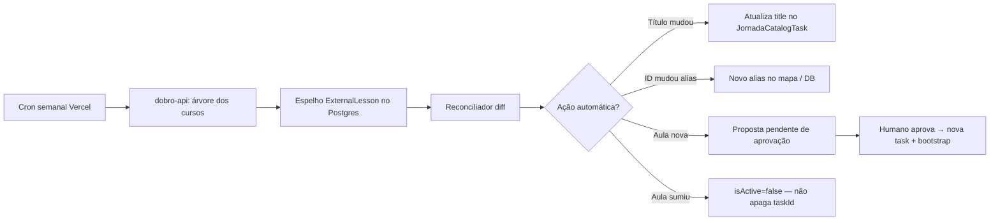

# Atualização automática do board — roadmap

Como manter a jornada Scudo alinhada quando a Curseduca ganhar, renomear ou mover aulas — **sem quebrar progresso dos alunos**.

---

## Onde estamos (Opção 1 + B — entregue)

| Peça | Status |
|------|--------|
| Catálogo no código (`mockJornada.ts` + mapa) | ✅ |
| Catálogo publicado no banco (`JornadaCatalogTask`) | ✅ |
| Rank congelado (`UserJornadaStageCompletion`) | ✅ |
| Bootstrap manual (`jornada:bootstrap-catalog`) | ✅ |
| Reconcile / diff (`jornada:reconcile-catalog`) | ✅ (só gera relatório) |
| Propor mapeamentos (`propose-lesson-mappings`) | ✅ |
| Aplicar propostas (`apply-lesson-mappings`) | ✅ (aliases + alta confiança) |

Hoje, quando entra aula nova na Curseduca, alguém roda scripts localmente, revisa e faz deploy + bootstrap.

---

## Próxima fase (Opção 2 — automação com governança)

### Fluxo alvo



### O que implementar (ordem)

#### Fase 2a — Espelho + cron (baixo risco)

1. **Tabela `ExternalLessonMirror`** (ou similar)
   - `curseducaId`, `title`, `courseSlug`, `moduleTitle`, `order`, `link`, `syncedAt`
   - Upsert idempotente a partir da dobro-api

2. **Endpoint cron** `GET /api/cron/jornada-sync-catalog`
   - Auth: `CRON_SECRET` (mesmo padrão MGM/jobs)
   - Agenda: semanal (ex.: domingo 4h) em `vercel.json`

3. **Job de sync do espelho** — só atualiza o espelho, não o board

#### Fase 2b — Reconcile automático (médio risco)

4. **Reconciliador server-side** (reutilizar lógica de `reconcile-curseduca-catalog.mjs`)
   - **Auto-aplicar:**
     - Atualização de `title` em task já mapeada
     - Alias quando `curseducaId` novo aponta para mesmo `taskId` (aula movida)
   - **Nunca auto-aplicar:**
     - Criar `taskId` novo
     - Remover/desativar task com progresso de alunos
     - Reordenar tasks no meio de rank ativo

5. **Tabela `JornadaCatalogChangeProposal`**
   - Diff pendente: aulas novas, órfãs, conflitos
   - Status: `pending` | `approved` | `rejected`

#### Fase 2c — Publicação assistida

6. **Script ou painel interno** para aprovar propostas
7. **`catalogVersion` bump** + bootstrap parcial (só tasks novas/alteradas)

---

## Regras de ouro (sempre)

1. **`taskId` imutável** — nunca renomear o que aluno já completou.
2. **Rank congelado prevalece** — `UserJornadaStageCompletion` não regride.
3. **Append-only** — aula nova = novo `taskId` no **fim** do rank (ou seção “conteúdo novo”).
4. **Remoção na Curseduca** → `isActive=false`, histórico preservado.
5. **Kill-switch** → `JORNADA_CATALOG_SOURCE=code` na Vercel.

---

## Envs para a fase 2

| Variável | Uso |
|----------|-----|
| `CRON_SECRET` | Já existe — proteger cron |
| `DOBRO_API_KEY` | Buscar árvore de cursos |
| `DOBRO_API_BASE_URL` | Gateway dobro-api |
| `JORNADA_AUTO_SYNC_ENABLED` | Flag para ligar/desligar auto-aplicação de títulos/aliases |
| `JORNADA_AUTO_SYNC_APPLY_TITLES` | `true` = atualiza título automaticamente |

---

## Estimativa

| Fase | Esforço | Risco |
|------|---------|-------|
| 2a Espelho + cron | ~1–2 dias | Baixo |
| 2b Reconcile auto (títulos/aliases) | ~2–3 dias | Médio |
| 2c Aprovação de aulas novas | ~2 dias | Baixo |

---

## Até lá (processo manual enxuto)

Quando souberem de mudança na Curseduca:

```bash
# 1. Diff
DOBRO_API_COURSE_SLUG= npm run jornada:reconcile-catalog

# 2. Revisar docs/jornada-catalog-reconcile.latest.json

# 3. Se aula nova: editar mockJornada + mapa, ou apply-lesson-mappings

# 4. Publicar
FORCE_BOOTSTRAP=1 CATALOG_DATABASE_URL="$DATABASE_URL_MIGRATION" npm run jornada:bootstrap-catalog

# 5. Redeploy se mudou código; só bootstrap se mudou só catálogo no DB
```

---

## Referência técnica completa

Ver [jornada-curseduca-opcoes-seguras.md](../jornada-curseduca-opcoes-seguras.md) — Opções 1, 2 e 3 com checklist de segurança.
