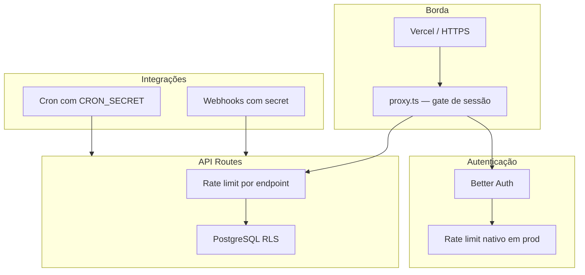

# Segurança — Scudo

Visão geral das camadas de proteção da Scudo (carrer-quest-v2) em produção. Documento focado no **estado atual** (~500 usuários); evoluções para escala maior ficam fora de escopo por enquanto.

## Camadas de defesa

| Camada | O que faz | Onde |
|--------|-----------|------|
| HTTPS | Tráfego criptografado | Vercel (default) |
| Gate de sessão | Páginas e APIs exigem cookie Better Auth | `proxy.ts` |
| Better Auth | Login, OAuth, reset de senha, CSRF/origin | `app/lib/auth.ts`, `/api/auth/*` |
| Rate limiting | Anti-abuso em rotas sensíveis | Ver seções abaixo |
| RLS (Row Level Security) | Isolamento de dados por usuário no Postgres | `app/lib/rls.ts`, Neon |
| Secrets de webhook/cron | Rotas públicas sem cookie, auth por header | Env vars na Vercel |

---

## Autenticação e sessão

- **Better Auth** com e-mail/senha e OAuth (Google, LinkedIn quando configurados).
- **`BETTER_AUTH_SECRET`** e URLs de origem confiáveis só no servidor.
- **`proxy.ts`** redireciona páginas não autenticadas para `/login` e responde `401` em APIs sem sessão.
- Rotas públicas explícitas: login, cadastro, recuperação de senha, `/i/[code]` (MGM), health e APIs com secret próprio.

### Rate limit do Better Auth (automático)

Em **produção**, o Better Auth liga rate limit sem configuração extra em `auth.ts`:

| Escopo | Limite |
|--------|--------|
| Rotas gerais `/api/auth/*` | ~100 req/janela por IP |
| Sign-in, sign-up, change-password | **3 req / 10 s** por IP |

Storage: **memória por instância** (serverless). Adequado para a base atual.

Formulários de recuperação de senha tratam `TOO_MANY_REQUESTS` / `RATE_LIMIT` na UI.

---

## Rate limiting customizado (API)

Implementação centralizada em **`app/lib/security/rateLimit.ts`**.

- Contador **in-memory** por processo (`globalThis`), com poda periódica de entradas expiradas.
- Chave autenticada: `{bucket}:user:{userId}`.
- Resposta ao exceder: **HTTP 429** + header **`Retry-After`** (segundos).
- Mensagem padrão: *"Muitas requisições. Aguarde antes de tentar novamente."*

### Limites por endpoint (críticos)

| Bucket | Rota | Limite | Motivo |
|--------|------|--------|--------|
| `jornadaTaskToggle` | `PATCH /api/jornada` | 120/min por usuário | Toggle de tarefas; generoso para marcar rank inteiro |
| `jornadaCurseducaSync` | `POST /api/jornada/curseduca-sync` | 3 / 5 min | Chama API externa Curseduca |
| `jornadaCodequestSync` | `POST /api/jornada/codequest-sync` | 10/min | Sync CodeQuest + snapshot |
| `profilePatch` | `PATCH /api/profile` | 20/min | Escrita de perfil + sync currículo |
| `generatedResumeSave` | `PATCH /api/profile/generated-resume` | 10/min | Salva documento + regenera PDF |
| `generatedResumeRead` | `POST /api/profile/generated-resume` | 30/min | Carrega documento no editor |
| `generatedResumePdfDownload` | `GET /api/profile/generated-resume` | 15/min | Download de PDF |
| `profileResumeUpload` | `POST /api/profile/resume` | 3 / 5 min | Upload + IA/parsing (flag) |
| `studentAccess` | `POST /api/auth/student-access` | 5/min por IP+e-mail | Validação Curseduca no cadastro |

### Limites já existentes (banco)

| Rota | Regra |
|------|-------|
| `POST /api/feedback` | 1 feedback/min por usuário (`productFeedback`) |
| `POST /api/jobs/[jobId]/reports` | 1 reporte / 15 min por usuário+vaga (`jobReport`) |

---

## Row Level Security (RLS)

Dados de perfil, jornada, MGM e feedback passam por **`withRlsUserContext(userId, …)`**, que define `app.user_id` na sessão Postgres antes das queries.

Detalhes operacionais: [`docs/rls-prisma-neon-playbook.md`](./rls-prisma-neon-playbook.md).

---

## Webhooks, cron e jobs

Rotas sem cookie de sessão; protegidas por **secret no header** ou token Vercel Cron:

| Rota | Secret / auth |
|------|----------------|
| `/api/jobs/webhook` | `JOBS_WEBHOOK_SECRET` |
| `/api/jobs/bootstrap` | `JOBS_BOOTSTRAP_SECRET` + cron |
| `/api/jobs/maintenance/*` | Secret de manutenção |
| `/api/referrals/hubla-webhook` | `HUBLA_WEBHOOK_SECRET` |
| `/api/referrals/asaas-webhook` | `ASAAS_WEBHOOK_SECRET` |
| `/api/cron/mgm-validate` | `CRON_SECRET` |

---

## Dados pessoais (LGPD)

- Export e limpeza de perfil: [`docs/lgpd-operations.md`](./lgpd-operations.md).
- Tokens ActiveCampaign, Curseduca, etc. **somente no servidor** (env Vercel).

---

## O que **não** está coberto (escala futura)

Para ~500 usuários com baixa concorrência, **não** implementamos ainda:

- Rate limit **distribuído** (Upstash, Vercel KV) entre instâncias serverless.
- Rate limit em **todas** as rotas autenticadas (GET jornada, listagem de vagas, etc.).
- Better Auth com storage de rate limit em **banco** (`rateLimit` table).
- WAF / bot management na borda.

Reavaliar quando houver sinais de abuso, pico de tráfego simultâneo ou auditoria externa.

---

## Checklist rápido (deploy / revisão)

- [ ] `BETTER_AUTH_SECRET` definido em prod
- [ ] Secrets de webhook/cron rotacionados se vazados
- [ ] `DATABASE_URL` usa role **runtime** (não owner) na app
- [ ] Migrations com role owner via script dedicado (`scripts/run-owner-migrations.sh`)
- [ ] Feature flags sensíveis revisadas (`ENABLE_RESUME_UPLOAD`, MGM, etc.)
- [ ] Após alterar `NEXT_PUBLIC_*`, **novo deploy** (valor inlined no build)

---

## Referências no código

| Arquivo | Responsabilidade |
|---------|------------------|
| `app/lib/security/rateLimit.ts` | Utilitário e constantes de limite |
| `proxy.ts` | Gate de autenticação global |
| `app/lib/auth.ts` | Better Auth |
| `app/lib/rls.ts` | Contexto RLS por usuário |
| `app/lib/featureFlags.ts` | Flags de funcionalidade |

---

*Última atualização: jul/2026 — rate limits em endpoints críticos da jornada, perfil e currículo ATS.*
